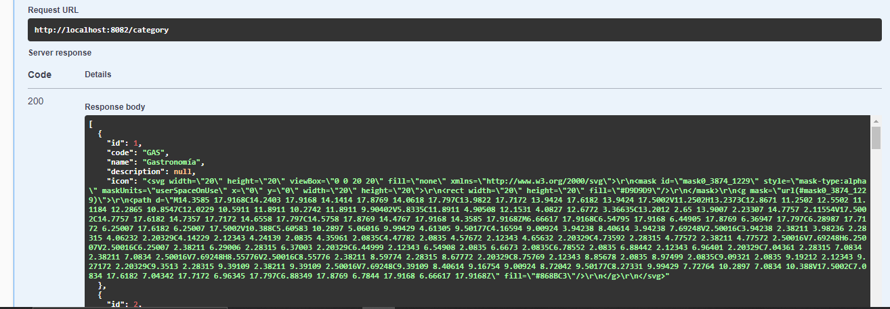

# Challenge Bricks

API de Administración de Productos

Esta API proporciona servicios para administrar los productos de un comercio, incluyendo la creación, actualización, eliminación y recuperación de productos, así como la obtención de una lista de categorías.

## Requisitos Técnicos

- Desarrollado en Java JDK 17 con Spring Boot y Maven.
- Base de datos en memoria H2.
- Integración con una API externa para obtener las categorías.

## Ejecución del Proyecto

1. Clona el repositorio desde GitHub o GitLab.
2. Abre el proyecto en tu IDE favorito.
3. Ejecuta el proyecto utilizando Maven.
4. Accede a la API desde el navegador o herramientas como Postman usando la URL [http://localhost:8082](http://localhost:8082).
5. Swagger URL [http://localhost:8082/doc/swagger-ui/index.html](http://localhost:8082/doc/swagger-ui/index.html).

## Endpoints Disponibles

| Método | Ruta              | Descripción                                                       | Ejemplo de Uso                                               |
| ------ | ----------------- | ----------------------------------------------------------------- | ------------------------------------------------------------ |
| GET    | /product          | Obtiene el listado de productos (filtro por name, price, stock y category) (Paginado) | `GET /product?name=producto1&price=10.00&stock=20&category=Gastronomía&page=0&size=10` |
| GET    | /product/{id}     | Obtiene un producto por ID                                        | `GET /product/1`                                             |
| POST   | /product          | Crea un nuevo producto                                             | `POST /product` con cuerpo: { "name": "Pava Electrica", "price": 25.00, "stock": 50, { "id": 1, "code": "GAS", "name": "Gastronomía", "description": null, "icon": "icono.svg" } } |
| DELETE | /product/{id}     | Elimina un producto por ID                                        | `DELETE /product/1`                                          |
| PUT    | /product    | Actualiza un producto por ID                                      | `PUT /product` con cuerpo: {id:"1", "name": "Producto Actualizado", "price": 30.00, "stock": 100, { "id": 2, "code": "VIA", "name": "Viajes", "description": null, "icon": "icono.svg" } } |
| GET    | /category         | Obtiene el listado de categorías                                  | `GET /category`                                               |

## Actualización de Categorías

Se analizó la necesidad de actualizar las categorías de forma periódica, teniendo en cuenta que el servicio externo tiene un límite de 10 solicitudes diarias. Para abordar este problema, se implementó una solución mediante un cronjob que se ejecuta cada tres horas al dia.

El cronjob realiza una solicitud al servicio externo para obtener las nuevas categorías. Si la solicitud es exitosa, la tabla de categorías en la base de datos se vacía y se actualiza con las nuevas categorías recibidas. De esta manera, se garantiza que las categorías estén siempre actualizadas y se evita exceder el límite de solicitudes diarias del servicio externo.

## Registro de Logs y Excepciones

Se agregó un mecanismo de registro de logs y manejo de excepciones para facilitar la depuración y el seguimiento de errores en la aplicación. En la sección de logs, se pueden encontrar registros detallados de las operaciones realizadas por la aplicación.

## Observación

Para visualizar la base de datos H2, accede a [http://localhost:8082/h2-console](http://localhost:8082/h2-console) en tu navegador.
- Usuario: admin
- Contraseña: admin
